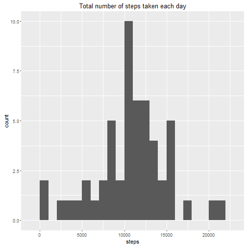
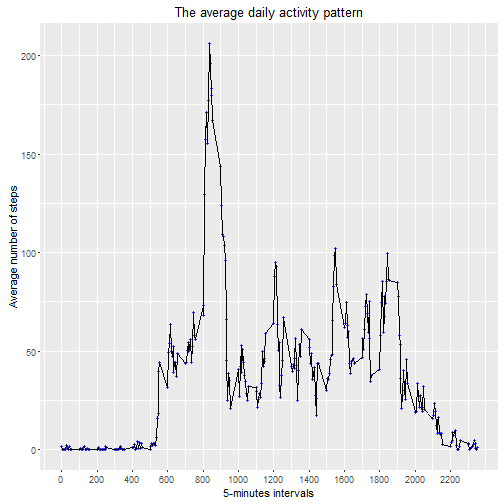

# Reproducible Research: Peer Assessment 1


Course Project by Aleksei Neveror

## Loading and preprocessing the data

This assignment makes use of data from a personal activity monitoring device. This device collects data at 5 minute intervals through out the day. The data consists of two months of data from an anonymous individual collected during the months of October and November, 2012 and include the number of steps taken in 5 minute intervals each day.

The data for this assignment can be downloaded from the course web site:

[Activity monitor data](https://d396qusza40orc.cloudfront.net/repdata%2Fdata%2Factivity.zip)

To perform the analysis we have to read sourse data

```r
data <- read.csv("activity.csv")
```

And research the structure of the dataset

```r
dim(data)
```

```
## [1] 17568     3
```

```r
str(data)
```

```
## 'data.frame':	17568 obs. of  3 variables:
##  $ steps   : int  NA NA NA NA NA NA NA NA NA NA ...
##  $ date    : Factor w/ 61 levels "2012-10-01","2012-10-02",..: 1 1 1 1 1 1 1 1 1 1 ...
##  $ interval: int  0 5 10 15 20 25 30 35 40 45 ...
```

To perform futher analysis we have to transform the dataset:

* change the type of the variable **data**
* create a new factor variable **daytype**, which should indicate is the day a weekday or weekend day. **weekend** and **weekday** are the possible values of this variable and also the factor levels


```r
data$date <- as.Date(data$date)

data$daytype  <- factor(ifelse(as.POSIXlt(data$date)$wday %in% c(0,6),"weekend","weekday"))
```

After changes we should have this structure of the dataset


```r
str(data)
```

```
## 'data.frame':	17568 obs. of  4 variables:
##  $ steps   : int  NA NA NA NA NA NA NA NA NA NA ...
##  $ date    : Date, format: "2012-10-01" "2012-10-01" ...
##  $ interval: int  0 5 10 15 20 25 30 35 40 45 ...
##  $ daytype : Factor w/ 2 levels "weekday","weekend": 1 1 1 1 1 1 1 1 1 1 ...
```

## What is mean total number of steps taken per day?

To evaluate the total number of steps taken per day it's nessesary to aggregate data by date


```r
totals <- aggregate(data$steps, by = list(data$date), FUN = sum)
names(totals) <- c("date","steps")
dim(totals)
```

```
## [1] 61  2
```

```r
head(totals)
```

```
##         date steps
## 1 2012-10-01    NA
## 2 2012-10-02   126
## 3 2012-10-03 11352
## 4 2012-10-04 12116
## 5 2012-10-05 13294
## 6 2012-10-06 15420
```

The result dataset contains 61 rows and just 2 variables. As we can see the dataset **totals** contains NAs as values of the **steps** variable. Try to calculate the number of NAs values in this dataset:


```r
sum(is.na(totals$steps))
```

```
## [1] 8
```

```r
mean(is.na(totals$steps))
```

```
## [1] 0.1311475
```

There are just 8 NA values of the **steps** variable or 13,1% of values. For now we'll just take in attention that there are NAs values, but later we'll try to fill missing values in datasets.

Let's look through the total numbers of steps taken per day. For this purpose we have to calculate mean and median values of the total numbers of steps:


```r
mean(totals$steps, na.rm =TRUE)
```

```
## [1] 10766.19
```

```r
median(totals$steps, na.rm =TRUE)
```

```
## [1] 10765
```

These values means that the individual was wearing this activity monitor did circa 10766,19 steps per day, and with the 50%-probability he did less than 10765 steps per day. 


```r
g <- ggplot(totals, aes(steps))
g <- g + geom_histogram(binwidth = 1000)
g <- g + labs("Total number of steps taken each day")
print(g)
```

```
## Warning: Removed 8 rows containing non-finite values (stat_bin).
```



The histogram shows than the individual did most frequently between 10000-15000 per day.

## What is the average daily activity pattern?

To analyse the average daily activity pattern it's nessesary to aggregate data by interval calculating the mean values for each interval. By aggregating we ignore the NAs:


```r
avgs <- aggregate(data$steps, by = list(data$interval), FUN = mean, na.rm = TRUE) 
names(avgs) <- c("interval", "steps")
avgs$interval <- as.numeric(paste(avgs$interval))
dim(avgs)
```

```
## [1] 288   2
```

```r
str(avgs)
```

```
## 'data.frame':	288 obs. of  2 variables:
##  $ interval: num  0 5 10 15 20 25 30 35 40 45 ...
##  $ steps   : num  1.717 0.3396 0.1321 0.1509 0.0755 ...
```

The time series plot of the 5-minute interval and the average number of steps taken, averaged across all days, is shown below:

```r
g <- ggplot(avgs, aes(interval, steps))
g <- g + geom_point(col = "blue", alpha = .5, size = 1)
g <- g + geom_path()
g <- g + scale_x_continuous(breaks = round(seq(min(avgs$interval), max(avgs$interval), by = 100),1))
g <- g + labs(title = "The average daily activity pattern")
g <- g + xlab("Intervals")
g <- g + ylab("Average number of steps")
print(g)
```



So we can see, that the individual took the most number of steps in the interval between 8:00 and 9:00. To determitane the 5-min interval in which the individual took the most number of steps it's nessesary to calculate the maximum of steps:


```r
as.integer(avgs[avgs$steps == max(avgs$steps),"interval"])
```

```
## [1] 835
```

So 


## Imputing missing values


## Are there differences in activity patterns between weekdays and weekends?
